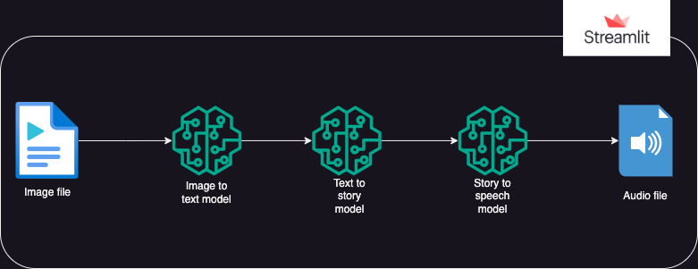

# 🖼️ VisionTale AI

> Transform images into creative stories and listen to them as speech.

[](https://visiontale-ai.streamlit.app/)
[](https://github.com/Sumayya012)

---

## 🚀 Live Demo

Try the deployed application directly in your browser:

### 👉 [https://visiontale-ai.streamlit.app/](https://visiontale-ai.streamlit.app/)

No local installation is required to try the live application.

---

## 📌 About the Project

**VisionTale AI** is a Streamlit-based Generative AI application that transforms an uploaded image into a short creative story and converts the generated story into speech.

The application combines **image understanding, generative AI, and text-to-speech** into a single end-to-end workflow.

### AI Pipeline

**Image → Image Caption → Story Generation → Speech Generation**

The project has been adapted and customized for current AI services, API integrations, application branding, and cloud deployment as a learning and portfolio project.

---

## ✨ Key Features

- 🖼️ Upload an image through the Streamlit interface
- 👁️ Generate an image description using BLIP
- ✍️ Generate a short creative story using Google Gemini
- 🔊 Convert the generated story into speech using Kokoro TTS
- 🌐 Access the application through a public Streamlit deployment
- 🎨 Personalized application interface and branding
- 🔐 API credentials kept outside the source code
- 🤖 Multiple AI models working together in one pipeline

---

## 🧠 AI Models Used

### 1. Image Captioning — BLIP

**Model:** `Salesforce/blip-image-captioning-base`

BLIP analyzes the uploaded image and generates a textual description of the detected scene.

### 2. Story Generation — Google Gemini

**Model:** `gemini-3.5-flash-lite`

Gemini receives the generated image description and creates a short creative story based on the scene.

### 3. Text-to-Speech — Kokoro

**Model:** `hexgrad/Kokoro-82M`

Kokoro converts the generated story into speech. The application accesses the model through the **Hugging Face Inference Client** using the `deepinfra` provider.

---

## 🔄 How It Works

```text
┌────────────────────┐
│   User Uploads     │
│      Image         │
└─────────┬──────────┘
          │
          ▼
┌─────────────────────────┐
│      BLIP Model         │
│   Image Captioning      │
└──────────┬──────────────┘
           │
           ▼
     Image Description
           │
           ▼
┌─────────────────────────┐
│     Google Gemini       │
│    Story Generation     │
└──────────┬──────────────┘
           │
           ▼
       Short Story
           │
           ▼
┌─────────────────────────┐
│       Kokoro-82M        │
│     Text-to-Speech      │
└──────────┬──────────────┘
           │
           ▼
       🔊 Audio Output
```

---

## 🏗️ System Architecture

The architecture represents the complete flow from image input to generated audio output.



---

## 🛠️ Technologies Used

**Application**
- Python
- Streamlit

**Artificial Intelligence**
- Hugging Face Transformers
- Salesforce BLIP
- Google Gemini API
- Kokoro TTS

**Libraries & APIs**
- PyTorch
- Torchvision
- Hugging Face Hub
- Google GenAI SDK
- python-dotenv

**Deployment & Version Control**
- Git
- GitHub
- Streamlit Community Cloud

---

## 📁 Project Structure

```text
VisionTale-AI/
│
├── img/
│   ├── my_logo.png
│   └── system-design.drawio.png
│
├── utils/
│   └── custom.py
│
├── app.py
├── requirements.txt
├── README.md
├── LICENSE
└── .gitignore
```

---

## ⚙️ Local Setup

### 1. Clone the repository

```bash
git clone https://github.com/Sumayya012/VisionTale-AI.git
cd VisionTale-AI
```

### 2. Create a virtual environment

```bash
python -m venv .venv
```

### 3. Activate the virtual environment

**Windows PowerShell**

```powershell
.\.venv\Scripts\Activate.ps1
```

### 4. Install dependencies

```bash
python -m pip install -r requirements.txt
```

### 5. Configure API keys

Create a `.env` file in the project root:

```env
GEMINI_API_KEY="your_gemini_api_key"
HUGGINGFACE_API_TOKEN="your_huggingface_token"
```

**Important:** Never upload `.env` or expose your API keys publicly. The `.env` file is excluded from Git using `.gitignore`.

### 6. Run the application

```bash
python -m streamlit run app.py
```

The application will open in your browser.

---

## 🔐 Environment Variables

| Variable | Purpose |
|---|---|
| `GEMINI_API_KEY` | Used for Gemini story generation |
| `HUGGINGFACE_API_TOKEN` | Used for Hugging Face model inference |

For the deployed Streamlit application, these credentials are configured through **Streamlit Secrets** rather than being stored in the GitHub repository.

---

## 📸 Application Output

VisionTale AI produces three main outputs from an uploaded image:

**1. Image Scenario**
The BLIP model analyzes the image and generates a textual description.

**2. Generated Story**
Google Gemini transforms the image description into a short creative story.

**3. Audio Narration**
The generated story is converted into speech using the Kokoro text-to-speech model.

---

## 🎯 Example Workflow

```text
📷 Uploaded Image
        │
        ▼
🤖 BLIP Image Model
        │
        ▼
📝 Image Description
        │
        ▼
✨ Google Gemini
        │
        ▼
📖 Short Story
        │
        ▼
🔊 Kokoro TTS
        │
        ▼
🎧 Audio Output
```

---

## 🌐 Deployment

VisionTale AI is deployed using **Streamlit Community Cloud**.

### Deployment Flow

```text
GitHub Repository
       │
       ▼
Streamlit Community Cloud
       │
       ├── Install dependencies
       ├── Configure secrets
       └── Run app.py
       │
       ▼
Live Streamlit Application
```

### Live Application

👉 [https://visiontale-ai.streamlit.app/](https://visiontale-ai.streamlit.app/)

---

## 📚 What I Learned

Through this project, I explored and practiced:

- Image captioning using BLIP
- Working with pretrained Hugging Face models
- Generative AI API integration
- Prompt-based story generation
- Text-to-speech inference
- Integrating multiple AI models into one application
- Streamlit application development
- Environment variables and API-key security
- Git and GitHub workflow
- Cloud deployment using Streamlit Community Cloud
- Building an end-to-end AI application pipeline

---

## 📌 Project Status

**Status:** ✅ Deployed and Working

The complete pipeline has been tested successfully:

```text
Image
  ↓
BLIP
  ↓
Image Description
  ↓
Gemini
  ↓
Short Story
  ↓
Kokoro TTS
  ↓
Audio
```

The application is currently available through the live Streamlit deployment.

---

## ⚠️ Limitations

- The application currently generates stories from a single uploaded image at a time.
- Story quality depends on how accurately the image caption describes the image.
- Generated stories are AI-written and may contain inaccuracies or unexpected content.
- A Gemini API key and an internet connection are required for story generation.
- Audio generation depends on the availability and performance of the text-to-speech model.
- The application is designed as an image-to-story-to-speech tool rather than a general-purpose chatbot.

---

## 🔮 Future Improvements

- Add support for multiple story styles and genres.
- Add language selection for stories and audio output.
- Add multiple voice options for the generated audio.
- Allow users to edit the generated story before audio conversion.
- Allow users to download the generated story and audio together.
- Add support for uploading multiple images to create one story.
- Migrate to newer model and API integrations as the project evolves.

---

## 📜 License

This project is licensed under the MIT License. See the [LICENSE](LICENSE) file for details.

---

## 👩‍💻 Author

**Mohammed Sumayya**

- GitHub: https://github.com/Sumayya012
- LinkedIn: https://www.linkedin.com/in/mohammed-sumayya/
